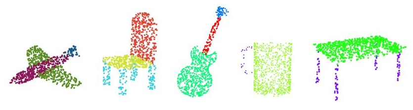

# 3D Point Cloud Tutorial

  

In my Master's thesis project, all the methods, models, and experiments are based on 3D point clouds. To gain a more comprehensive understanding about such a 3D data, I enrolled in a MOOC course to acquire the essential knowledge and commonly-used techniques for working with 3D point clouds.

There are nine chapters in this course. As of August 20, 2023, I have completed the first six chapters. In addition to programming and experiments, I wrote six succinct reports, one for each chapter, for the purpose of conclusion and review.

#### 1. Introduction and Basic Algorithms
This chapter introduces several key characteristics of 3D point clouds and three commonly-used techniques: PCA, surface normal estimation, and voxel grid downsampling.  

Report: [Assignment 1 - Introduction and Basic Algorithms](https://github.com/jxl152/3D-PointCloud-Tutorial/blob/main/1.%20Introduction%20and%20Basic%20Algorithms/chapter01_report.pdf)

#### 2. Nearest Neighbor Problem
This chapter introduces two data structures adapted: k-d tree and octree. Both of these structures can utilize either k-NN or radius search methods to find the nearest neighbors.  

Report: [Assignment 2 - Nearest Neighbor Problem](https://github.com/jxl152/3D-PointCloud-Tutorial/blob/main/2.%20Nearet%20Neighbor%20Problem/2.%20Nearest_Neighbor_Problem.pdf)

#### 3. Clustering
This chapter introduces three clustering algorithms: K-Means, GMM, and spectral clustering. I implemented all of them and compare their effectiveness with that of Sklearn.  

Report: [Assigment 3 - Clustering](https://github.com/jxl152/3D-PointCloud-Tutorial/blob/main/3.%20Clustering/3.%20Clustering.pdf)

#### 4. Model Fitting
This chapter introduces the RANSAC algorithm and its application to ground detection. 

Report: [Assignment 4 - Model Fitting](https://github.com/jxl152/3D-PointCloud-Tutorial/blob/main/4.%20Model%20Fitting/4.%20Model_Fitting.pdf)

#### 5. Deep Learning on Point Cloud
This chapter introduces deep learning on 3D point clouds. In the assignment, I implemented, trained, and evaluated a PointNet model. Implementing PointNet is instructive practice, as it is a pioneering work in this field, serving as the foundation for numerous subsequent methods.  

Report: [Assignment 5 - Deep Learning on Point Cloud](https://github.com/jxl152/3D-PointCloud-Tutorial/blob/main/5.%20Deep%20Learning%20on%20Point%20Cloud/5.%20Deep_Learning_on_Point_Cloud.pdf)

#### 6. 3D Object Detection
This chapters introduces many methods for 3D object detection. However, the assignment is nothing but helps students be familiar with the KITTI object detection dataset.   

Report: [Assignment 6 - Evaluation of KITTI 3D objection detection results](https://github.com/jxl152/3D-PointCloud-Tutorial/blob/main/6.%203D%20Object%20Detection/6.%20Evaluation_of_KITTI_3D_objection_detection_results.pdf)

#### 7. 3D Feature Detection 

Not finished yet...

#### 8. 3D Feature Description

Not finished yet...

#### 9. Registration

Not finished yet...
